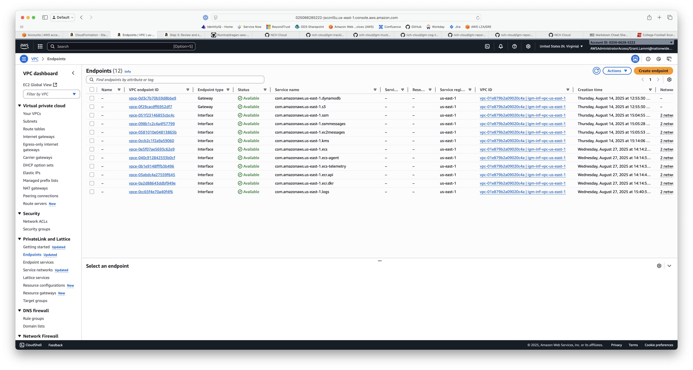
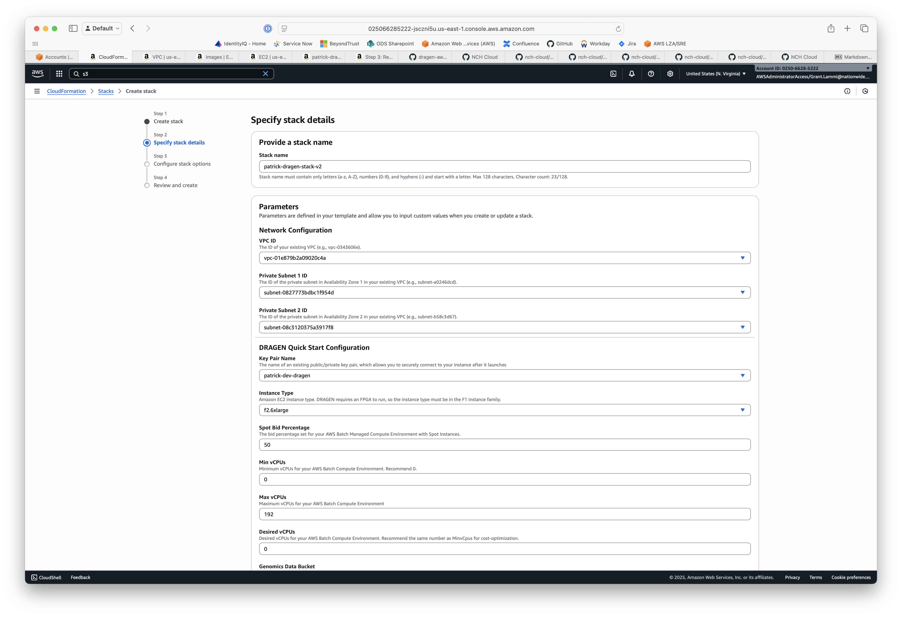
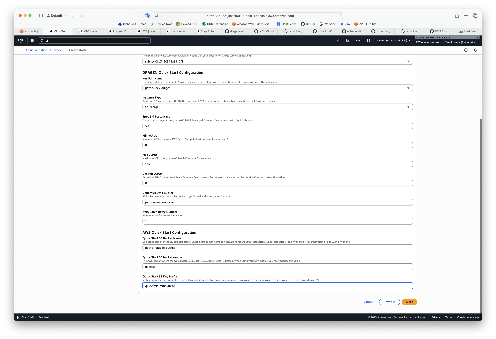
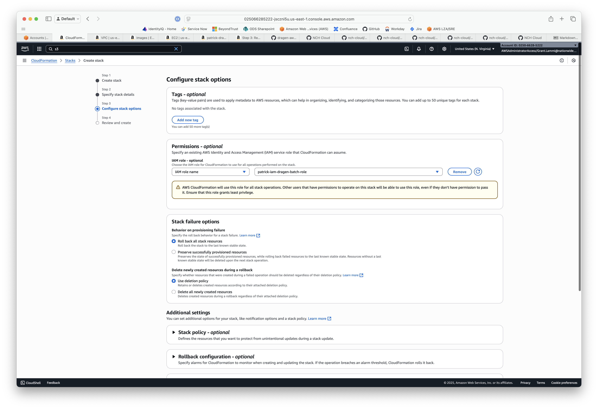

# NCH DRAGEN Batch Deployment

Illumina was kind enough to do a proof-of-concept for running DRAGEN as part of AWS Batch in us-east-1 while reading/writing from us-east-2. Because AWS is not going to have the new F2 instance types in us-east-2, and because they are retiring the F1's already in us-east-2, this is our best setup option going forward.

The deployment right now uses a minor update to a forked copy of their **dragen-aws-batch-quickstart** repo on the 4.4.4 branch. I have made very minor changes to the templates/batch.template.yaml file so it:

1. Has the correct ports open to get at the Illumina license server.
2. Uses the very lately private DRAGEN AMI that Illumina has enabled for our accounts.
3. Made sure Docker is correctly installed.
4. Installed and configured AWS SSM agent so we can connect with SSM to the running instances.

## Deploying

This is a bit of a funny deployment in that certain files from the git repo need to be copied to a S3 bucket before doing the CloudFormation deployment. 

As an example, I have created a "quickstart-templates" prefix in the "patrick-dragen-bucket". Then you need to recursively copy the "templates/" and "app/" directories from the git tree in that "quickstart-template" prefix. The CloudFormation install will ask for this bucket + prefix as part of setting its parameters.

## CloudFormation Settings

I'm not sure how needed this is, but this is a screenshot of all the VPC endpoints that I have configured in Patrick's dev.



And the following are a set of screenshots showing the options I used when deploying:







And finally here is the input command I used when running a job that succeeded:

```
[DEBUG] Dragen input commands: -f --ref-dir s3://patrick-dragen-bucket/20250826_dragen_test/input_files/reference_4_4/ -1 s3://patrick-dragen-bucket/20250826_dragen_test/input_files/fastq/HG001_RapidGenome_S3_L001_R1_001.fastq.gz -2 s3://patrick-dragen-bucket/20250826_dragen_test/input_files/fastq/HG001_RapidGenome_S3_L001_R2_001.fastq.gz --RGID HG001-RapidGenome_S-2023-033940_GS-NEB-0364 --RGSM HG001-RapidGenome_S-2023-033940_GS-NEB-0364 --enable-map-align true --enable-map-align-output true --enable-duplicate-marking true --output-format CRAM --enable-variant-caller true --vc-emit-ref-confidence GVCF --vc-enable-vcf-output true --output-file-prefix HG001-RapidGenome_S-2023-033940_GS-NEB-0364 --output-directory s3://patrick-dragen-bucket/20250826_dragen_test/results/ --lic-server REDACTED
```

You can find the whole log at dragen/default/3b7a9f5c8f52446f84c8a6fbbd565722 in Patrick's account: 025066285222

> [!NOTE]
> As of this writing I have NOT gotten cross-account AND cross-region DRAGEN Batch jobs to work. I believe that this will work fine as single account and cross-region.